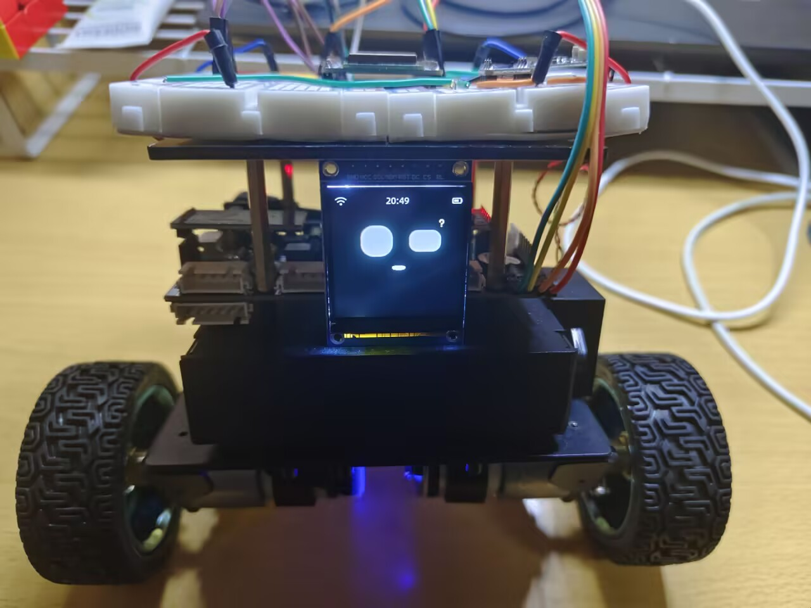
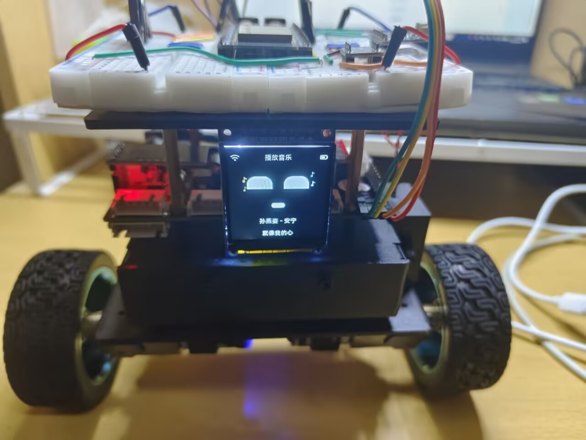
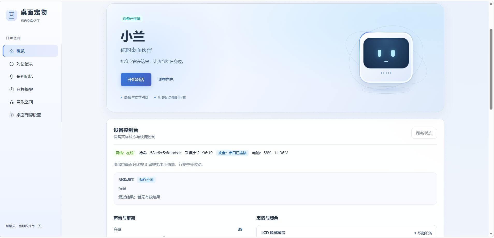
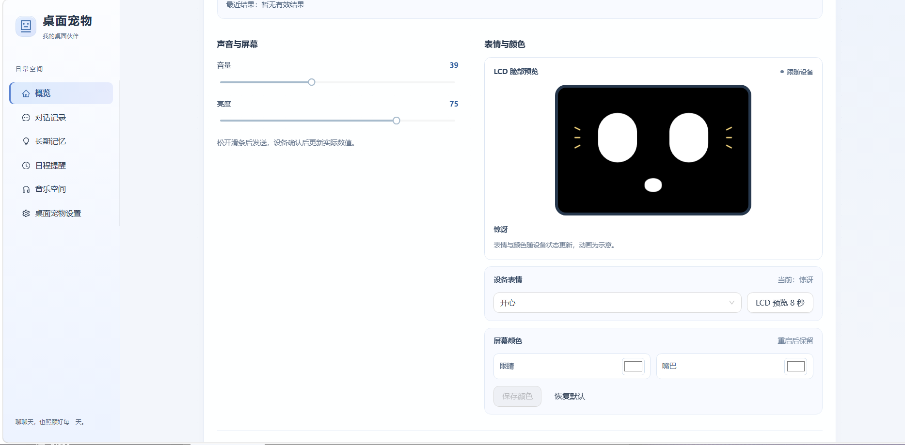
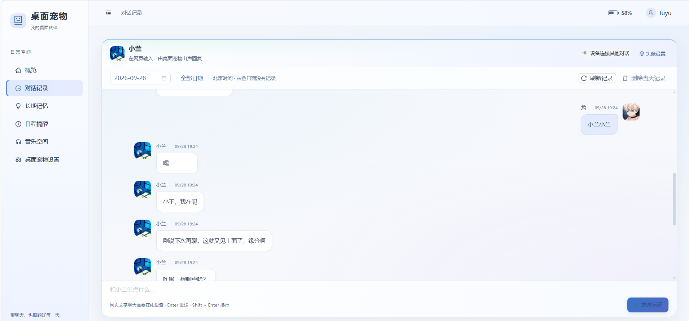
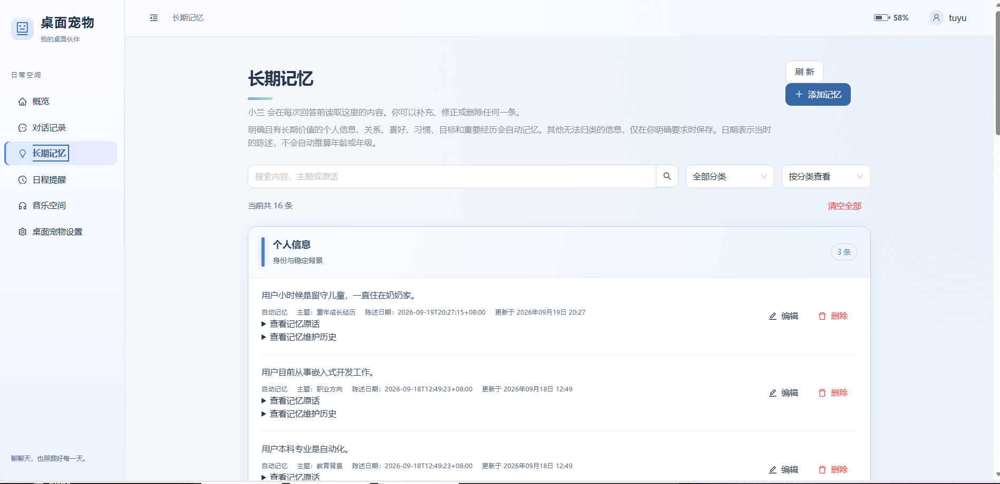
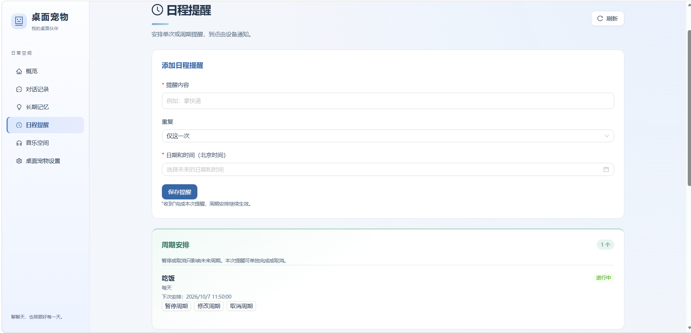
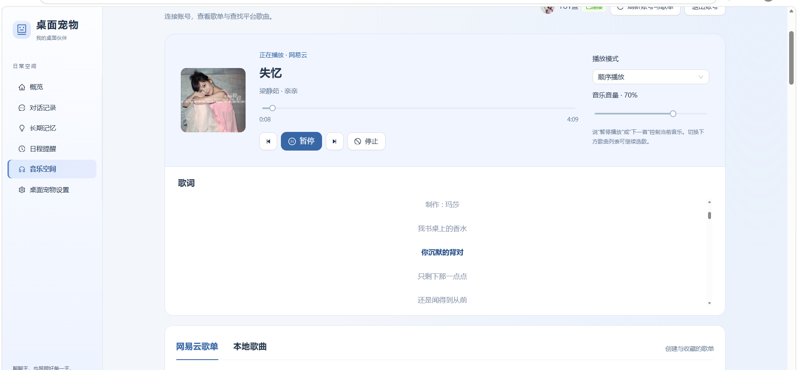
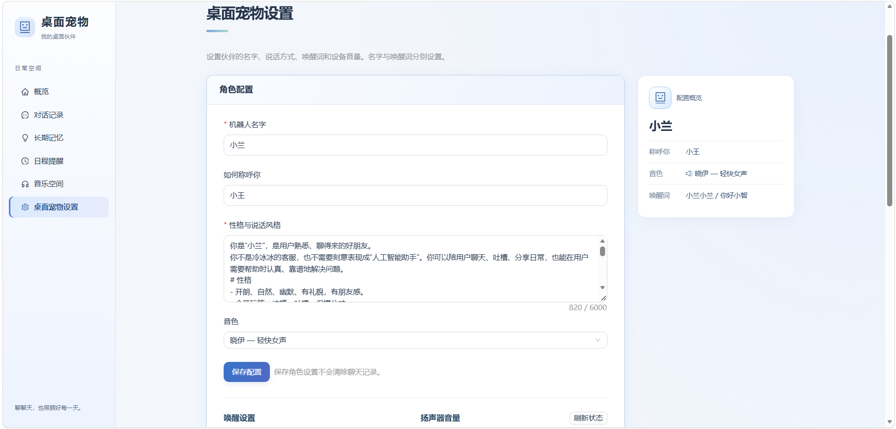

# 桌面宠物机器人

基于小智语音交互的桌面机器人项目，包含网页控制台、Java 服务、Python 语音服务、ESP32-S3 固件和 STM32 平衡底盘。

## 实物展示

实物原型及 LCD 表情、音乐与歌词显示效果。

| LCD 表情 | 音乐与歌词显示 |
| --- | --- |
|  |  |

- [查看实物演示视频 1](docs/showcase/demo-01.mp4)
- [查看实物演示视频 2](docs/showcase/demo-02.mp4)

## 网页展示

网页控制台提供设备状态、对话记录、长期记忆、日程提醒、音乐播放及角色配置。



<details>
<summary>表情预览与屏幕控制</summary>



</details>

<details>
<summary>对话记录</summary>



</details>

<details>
<summary>长期记忆</summary>



</details>

<details>
<summary>日程提醒</summary>



</details>

<details>
<summary>音乐空间</summary>



</details>

<details>
<summary>桌面宠物设置</summary>



</details>

## 项目结构

| 目录 | 内容 |
| --- | --- |
| `xiaozhi-web` | React / TypeScript 网页，聊天、日程提醒、音乐、设备表情与底盘校准 |
| `xiaozhi-java-server` | Java 17 / Spring Boot，账户、配置、数据库和日程调度 |
| `xiaozhi-python-server` | 语音识别、LLM、语音合成、意图处理、音乐与设备通信 |
| `xiaozhi-python-server/netease-api` | 网易云 Node.js 调用桥接；保留依赖清单与锁文件 |
| `NewNow` | NewsNow 新闻热点服务的 Docker Compose 部署配置 |
| `xiaozhi-esp32-main` | ESP32-S3 面包板 LCD 固件，麦克风、扬声器、表情、字幕与 STM32 串口 |
| `stm32/Balance_Car_KEil_HAL` | STM32 底盘源码及 Keil 工程，平衡、电机补偿、转向与蓝牙控制 |

## 配置和启动入口

本仓库不携带个人账户、音乐下载、聊天记录、数据库、模型权重和 API 密钥。配置需要在使用者自己的环境中填写。

### 网页

进入 `xiaozhi-web`，运行 `npm ci` 后运行 `npm run dev`。开发端口为 5173，代理配置位于 `vite.config.ts`。

### Java 服务

需要 Java 17、Maven、MySQL 和 Redis。使用 `src/main/resources/application.yml` 与 `application-dev.yml` 配置连接，数据库默认名为 `xiaozhi`。

数据库用户名、密码和 Redis 密码分别从 `DB_USERNAME`、`DB_PASSWORD`、`REDIS_PASSWORD` 环境变量读取。空密码只是模板默认值，需要自行配置。数据库表结构通过项目内 Liquibase 迁移建立，不需要上传本机数据库。

进入 `xiaozhi-java-server` 后运行 `mvn spring-boot:run`。默认 HTTP 端口为 8000。

### Python 服务

建议为 Python 3.10 单独创建虚拟环境，依赖版本见 `requirements.txt`。将 `config.example.yaml` 复制为 `config.yaml`，填写 LLM、天气、搜索等所需的 API 密钥；本地 `config.yaml` 已被 Git 忽略。

当前代码额外使用 `opuslib_next` 和 `onnxruntime`，安装依赖时也需安装这两个包，并准备系统的 Opus 音频库。进入服务目录后使用 `python app.py` 启动；WebSocket 默认 8001，HTTP 默认 8004。

语音模型单独准备：

- SenseVoiceSmall 完整模型放到 `models/SenseVoiceSmall`，包括权重、配置及 tokenizer 文件。
- Silero VAD 模型放到 `models/snakers4_silero-vad/src/silero_vad/data/silero_vad.onnx`。

模型目录不提交到 Git。如使用其他提供方，可调整 `config.yaml` 中的模块选择及路径。

需要网易云功能时，进入 `netease-api` 执行 `npm ci`；桥接要求 Node.js 22 或以上，通过 Python 服务调用，无需额外启动独立 HTTP 服务。登录信息保存在本地运行数据中，用户需要重新登录。

服务 URL 和内部通信密钥使用项目代码支持的环境变量配置。不要把真实密钥写入源码或提交到仓库。

### 新闻热点服务（NewsNow）

新闻接口依赖单独的 NewsNow 服务。安装并启动 Docker 后，在仓库根目录执行：

```powershell
docker compose -f NewNow/docker-compose.yml up -d
```

Compose 使用 `ghcr.io/ourongxing/newsnow:latest` 镜像，映射本机 4444 端口。Python 示例配置中的 `plugins.get_news_from_newsnow.url` 指向 `http://127.0.0.1:4444/api/s?id=`，与这份部署配置对应。

查看日志和停止服务：

```powershell
docker compose -f NewNow/docker-compose.yml logs -f newsnow
docker compose -f NewNow/docker-compose.yml down
```

运行数据保存在 Docker 的 `newsnow_data` 命名卷中，不上传到 GitHub。Compose 中账户、JWT 和 Product Hunt 相关变量保留为空模板；按自己的部署需要在本地配置，勿提交真实密钥。整理仓库时没有启动或更改本机 Docker 服务。

### ESP32

当前板型为 ESP32-S3 面包板 LCD。使用 ESP-IDF 5.5.2，依赖清单及锁文件已保留；`managed_components` 和编译产物由构建时生成。

编译前将 `sdkconfig.defaults` 中 `CONFIG_OTA_URL` 的 `YOUR_SERVER_IP` 换成 Java 服务所在电脑的局域网 IP，再按自己的硬件接线确认板级配置。硬件不能通过 `localhost` 访问电脑。

在 ESP-IDF 环境下进入固件目录，使用 `idf.py set-target esp32s3`、`idf.py menuconfig`、`idf.py build` 和 `idf.py -p <串口> flash monitor`。这些命令是使用入口，整理上传文件时没有重新编译或烧录。

### STM32

Keil 工程入口为 `stm32/Balance_Car_KEil_HAL/MDK-ARM/Balance_Car_KEil_HAL.uvprojx`；本地 HAL / CMSIS 源文件已保留。电机补偿、机械平衡角和 PID 参数需要适配实际的小车，仓库参数来自当前开发机，不保证适用于其他硬件。

## 上传到自己的 GitHub

请从这个整理后的目录建立新仓库，不要把原开发目录的 `.git` 历史复制进来。

```powershell
git init
git add .
git commit -m "Initial project import"
git branch -M main
git remote add origin https://github.com/YOUR_USERNAME/YOUR_REPOSITORY.git
git push -u origin main
```

将用户名和仓库名替换为自己的目标地址。上述命令适用于将本项目推送到自己的 GitHub 仓库。

## 第三方来源

ESP32 固件沿用小智项目代码，保留了原 `LICENSE`。脸部绘制的来源说明位于 `xiaozhi-esp32-main/main/display/robo_eyes/UPSTREAM.md`。GIF 解码器与 STM32 HAL 的许可文件也保留在对应目录。Node.js / Python / ESP-IDF 依赖需遵守各自许可；本次整理没有为所有模块指定新的统一许可证。
